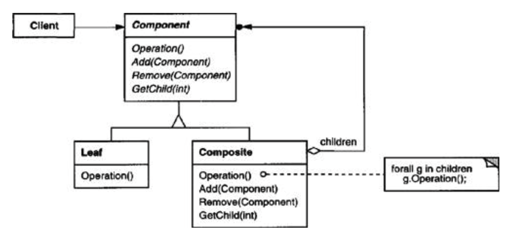

# Object Oriented Programming Design and Principles

## Goals of OOP

- Flexible
- Extensible
- Reusable

---

### Quick Definitions

- **Client Code**: Any code that has access to that object. Only knows object by its public interface.
- **Interface**: The set of all functions and operators a class defines _publicly_.
- **Implementation**: The definition of an objects interface. The client does not know about this. State and the definitions of member functions and the operators.

## 4 Principles

- Encapsulation
- Abstraction
- Inheritance
- Polymorphism

### 1. Encapsulation

Data and behaviors are encapsulated together behind an interface. - Member functions have direct access to the member variables of the object via _this_. This simplifies function calls.

**Proper _encapsulation_**:

1. Data of a class remains internal.
2. Client can only interact with the data via the interface.

### 2. Abstraction

An object presents only the necessary interface to client code.

- Hides unnecessary implementation details from the client.
  - Member functions that client code does not need should be private or protected.

### 3. Inheritance

- **Implementation Inheritance**
  - Class inherits interface and implementation of its base class.
- **Interface Inheritance** (abstract base class in C++, pure virtual functions)
  - Abstract classes in C++, known as _interfaces_ in Java.
  - **Benefits**
    - Reduce dependencies between base/derived class
    - (Flexible, Extensible, Reusable) Code the client to depend on an interface rather than a specific implementation.

#### **Multiple Inheritance**

- Class should inherit **implementation** from one class only (_extends_ in Java, not forced in C++)
- Class can inherit as many interfaces it would like. (_implements_ in Java)

### 4. Polymorphism

A single interface may have many different implementations (virtual functions and function overriding in C++)

**Benefits:**

- Avoid nasty switch statements (function calls resolve dynamically.)
- (Flexible) Allows the implementation of an interface to change at **run time**.

---

### Programming interfaces in C++

- Abstract base class using pure virtual functions to declare the interface.
- Implement the interface in subclasses via public inheritance.
- Client maintains reference or pointer to the base class.
- Calls through the reference or pointer is polymorphic.

## Adapter Pattern

Can be implemented using:

- Inheritance (creates dependencies)
- Composition (uses composed object's interface)

# Design Patterns

### Creational Patterns

- Describes how objects are created and initialized.
  - Builder, abstract factory, factory singleton, prototype.

## Singleton Pattern

Enforce only single object of given type exists. - Instantiates the object on demand. - Easy to obtain an alias from anywhere in program

```cpp
// Portfolio.h
class Portfolio {
private:
    static Portfolio * instance_; // Static pointer to the only object of this class. Not a member variable.
    Portfolio (); // IMPORTANT, constructor MUST be PRIVATE.
    virtual ~Portfolio (); // IMPORTANT, destructor MUST be PRIVATE.
public:
    static Portfolio * instance(); // Function that allows access to the singleton object.
}
    Portfolio * Portfolio::instance_ = 0; // Init singleton to 0.
    Portfolio * Portfolio::instance() { // returns access to the obj. Inits if == 0.
    if (instance_ == 0){
        instance_ = new Portfolio;
    }
    return instance_;
    }
    void Portfolio::fini() { // Destructs the obj.
    delete instance_;
    instance_ = 0;`

    }
```

```cpp
// main.cpp
int main (int, char * []) {
    try {
        Stock *s = new Stock ("Alice's Restaurant", 20, 7, 11, 13);
        Bond *b = new Bond ("City Infrastructure", 10, 2, 3, 5);
        Portfolio::instance()->add (s);
        Portfolio::instance()->add (b);
        Portfolio::instance()->print ();
        Portfolio::fini();
    }
    catch (Portfolio::error_condition &e) {
        cout << "Portfolio error: " << e << endl;
        return -1;
    }
    catch (...) {
        cout << "unknown error" << endl;
        return -2;
    }
    return 0;
}
```

## Prototype Pattern

- Wraps copy construction within a common virtual method
- Each subclass overrides that method: uses its specific copy constructor with dynamic allocation to “clone” itself.

```cpp
//Security.h
struct Security {
  public:
    virtual Security * clone () = 0; // Pure virtual method.
};

Security * Stock::clone () {
return new Stock(*this);
}

Security * Bond::clone () {
    return new Bond(*this);
}

Security * Agent::sell (Security *s){
    Security * current = Portfolio::instance(this)->find(s);
    if (current == 0) {
        throw cannot_provide;
    }
    Security * copy = current->clone(); // Dynamically bind to the clone function of the class.
    Portfolio::instance(this)->remove(current);
    reserve_ += copy->shares_ * copy->current_value_;
    return copy;
}
```

## Factory Method Pattern

Creating a related type polymorphically using a factory class.

_See Studio 18 assignment for implementation._

# Behavioral Design Patterns

Concerned with algorithms and how responsibilities are assigned between objects.

- Patterns of communiciation between objects at run time.

## Strategy Pattern

Define a family of algorithms that are interchangeable at run-time. Decouples client from the specific algorithms it uses.

- Share abstract base class defining family for share via SMS, email, etc.

### Object Modeling Technique (OMT)


- Italicised are **abstract base class**. (eg. _Strategy_)
  - _AlgorithmInterface()_ is a pure virtual member function.
- Triangle represents **inheritance**.
- Boxes not italicised represent **classes**.
- Diamond represents **composition**.

## Visitor Pattern

**Goal**:Separate an algorithm from the objects it operates on. Allows adding new operations to existing objects without modifying the objects.

**Core Solution**: A visitor implements specializations of a given function for each concrete class in a family of classes. The visitor is passed a pointer to the object it is defining an operation for, giving the visitor access to the object. The visitor makes use of double dispatch, a form of delegation.

- **Delegation**: execute a member function of one object (receiver) using the state of another object (sender). The receiver member function is passed a pointer to the sender, giving it access to the sender’s state.

- **Double dispatch**: dispatches a function call to different concrete functions depending on the runtime types of two objects involved in the call

### Participants

1. Visitor - declares a Visit operation for each class of ConcreteElement in the object structure. The operation’s name and signature identifies the class that sends the Visit request to the visitor. That lets the visitor determine the concrete class of the element being visited.
2. ConcreteVisitor - implements each operation declared by Visitor. Each operation implements a fragment of the algorithm defined for the corresponding class of object in the structure.
3. Element - declares an Accept operation that takes a visitor as an argument.
4. ConcreteElement - implements an Accept operation that takes a visitor as an argument.
5. ObjectStructure - may either be a composite or a collection such as a list or a set of objects that are visited by the visitor

```cpp
// Visitor
struct SecurityVisitor {
  virtual void visit_stock (Stock *) = 0;
  virtual void visit_bond (Bond *) = 0;
};
```

```cpp
struct Security {
  virtual void accept (SecurityVisitor * sv) = 0;
};
```

```cpp
// Concrete elements
void Stock::accept (SecurityVisitor * sv) {
    if (sv) {sv->visit_stock(this);} // Delegation by passing 'this'
}

void Bond::accept (SecurityVisitor * sv){
  if (sv) {sv->visit_bond(this);}
}
```

```cpp
struct ProjectedValueFunctor : public SecurityVisitor {
  int & value_;

  ProjectedValueFunctor (int & value);

  virtual ~ProjectedValueFunctor ();

  void operator () (Security * s) {
    s->accept(this);
    }

  virtual void visit_stock (Stock * s) {
    if (s) {
        value_ += s->shares_ * (s->projected_value_ + s->dividend_);
        }
    }

  virtual void visit_bond (Bond * b) {
      if (b) {
          value_ += b->shares_ * (b->projected_value_ + b->interest_);
        }
    }
}
```

## Observer Pattern

Need to update multiple objects when the state of one objects changes.

- Usually used in UI applications.

## Interaction Diagrams


- Vertical line for each object involved in the pattern.
- Y - axis represents **time** from top 0 and increasing.
- Straight line means idle object.
- Horizontal lines are **requests** with arrows.

# Structual Design Patterns

Identify simple ways to realize relationships between objects. Focused on defining fixed structural relationships between objects.

## Composite Pattern

Composite object: An object composed of zero or more objects, all exhibiting similar functionality. (defining same interface)

**Motivation**: Allows tree-like structures containing composite and leaf objects. Simplifies code by allowing client code to interact with all objects (composite or leaf) indiscriminately.

### Participants:

1. Component - declares the interface for all components, including composites and leaves
2. Composite - represents a component that may contain children. Component methods often defined by forwarding request to all children
3. Leaf - represents a component without children
4. Context (client) - interacts with a composite object using the interface
   presented by “Component”.



- _Component_ is an abstract base class.
- Leaves do not override composite objects.

  - Define abstract base class assuming it is a leaf node, override these functions in the composite classes.

- Filled in circle represents 0 to many relationship. (UMT Tip)

- Circle with dashes represents pseudo code.

### A typical Composite Object


## Proxy Pattern

Provide a placeholder (proxy) for another object. The proxy controls access to the object.

**Motivation**:

- Provide a local copy of an object stored elsewhere(on disk, in a database, etc..). Provides a means for caching as well
- Defer creation of an expensive object until it is needed
- Control access to an object (ex: file permissions (lab 5), authentication)
- Smart references

**Participants**:

- Proxy
  - Maintains a pointer to a Subject
  - Provides the same interface as Subject, allows proxy to be used in place of a Subject
  - Controls access to or performs other bookkeeping functionality on the Subject
- Subject
  - Declares an interface shared by RealSubject and the Proxy
- RealSubject
  - The real object that a proxy represents. Defines the Subject interface.

### Proxy Pattern OMT


- Proxy defines its functions to forward request to the real subject.
- Proxy can act as an authentication middleware.
